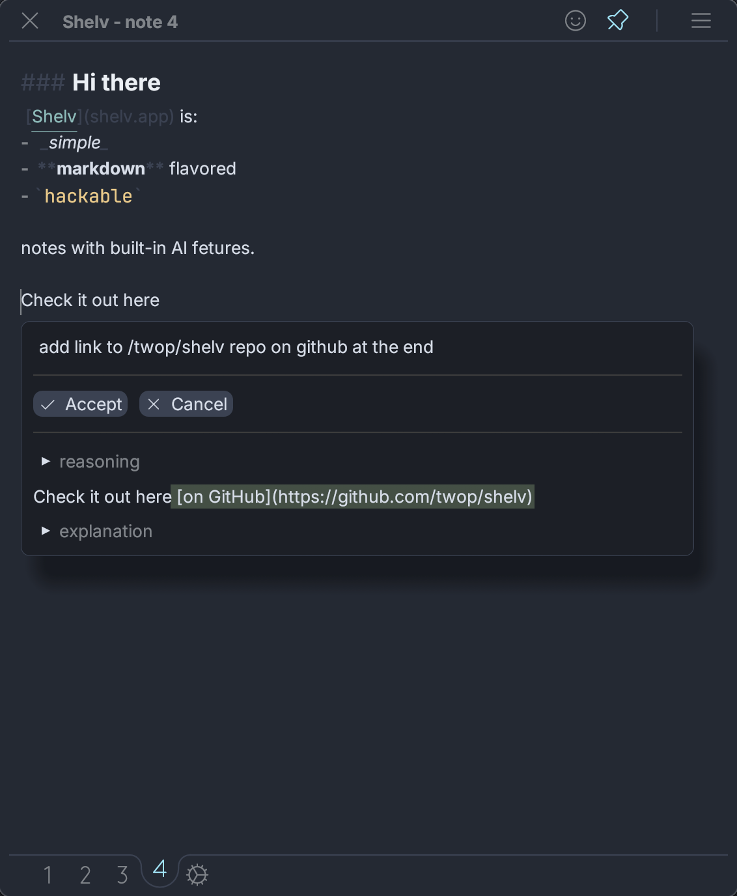

# Shelv

## Hackable, Local, AI-powered notes

Shelv is scriptable, plain text notes app with integrated ai-features for macOS, written in Rust (btw (tm)).



### Make It Yours

Settings in Shelv is just a note, where you can create custom commands with [KDL](https://kdl.dev/) and JavaScript, assign and tweak keyboard shortcuts, all with live reload.

The origin story: at the time I used [Bear app](https://bear.app/), which has 4 versions of date, but I wanted it in YYYY/mmm/dd format, and I keep thinking: "if only I can just define what I want". Well, with Shelv you can.


---

## Features

- **Markdown Support**: Full CommonMark with extensions, including TODOs
- **Code Syntax Highlighting**: A lot of languages are supported
- **Live JavaScript Blocks**: Execute JS code directly in notes
- **Slash Menu**: Quick access to all commands and features
- **Keyboard minded**: Most actilns are available via shortcuts
- **Quick Prompt**: You can ask AI about your text selection, with the note as the context + shelv system info. And yes, you can choose your models.

### Markdown stuff
1. lists,**bold**, *italic*, ~strikethrough~
	* [ ] todos, `monospace`

```rs
println!("Just syntax highlighted")
```

### Live JS code blocks

```js 1
console.log('I can be run!');
new Map().set("with", "live reload")
```

will produce this output if you press "Run" button that will appear on the left of JS code blocks.
```js 1 > #e904
I can be run!
Map { "with" → "live reload" }
```

Note the syntax `js 1` and `js 1 > #e904`, `1` indicates block id that is automatically assigned when you run the block.

---

## Default Shortcuts

*Placeholder - to be filled in later*

---

## Mini Documentation

### Shelv Settings

Settings are defined in the settings note and can be accessed by clicking a gear button on the bottom bar, using a shortcut, or clicking on a link inside a note: `shelv://settings`.

Settings can contain any number of markdown code blocks with `kdl` language. These blocks define the app's behavior.

#### Custom Snippets via `InsertText` Command

The `InsertText` command allows you to insert either static or dynamic text into your notes:

1. **Direct text insertion:**
```kdl
bind "Cmd T" icon="\u{E10A}" alias="test" description="Insert test text" {
    InsertText {
        as_is "This is a test"
    }
}
```

2. **Dynamic text via JavaScript functions:**
```kdl
bind "Cmd T" {
    InsertText {
        text {
            callFunc "myFunction"
        }
    }
}
```

JavaScript functions must be exported from `js` code blocks in the settings note. Each block is evaluated as a separate js module from top to bottom, with exported variables automatically imported into subsequent modules.

### Supported AI Providers

Shelv supports multiple AI providers through the [rust-genai](https://github.com/jeremychone/rust-genai) library:

- **OpenAI**: Models start with "gpt" (e.g., "gpt-4o-mini", "gpt-4")
- **Anthropic**: Models start with "claude" (e.g., "claude-3-haiku-20240307", "claude-3-5-sonnet-20240620")  
- **Cohere**: Models start with "command" (e.g., "command-light")
- **Gemini**: Models start with "gemini" (e.g., "gemini-2.0-flash")
- **Groq**: Specific model names (e.g., "llama-3.1-8b-instant")
- **Ollama**: Local model names (e.g., "gemma:2b")
- **XAI/Grok**: Specific model names (e.g., "grok-beta")
- **DeepSeek**: Specific model names (e.g., "deepseek-chat")

### Settings Schema

#### Keybinding Format
- `global`: System-wide shortcuts - Format: `global "Shortcut" { Action; }`
- `bind`: In-app keybindings - Format: `bind "Shortcut" { Action; }`

#### Optional Attributes for bind
- `icon`: Phosphor icon unicode for slash palette ([full list](https://phosphoricons.com))
- `alias`: Command name in slash palette
- `description`: Description shown in slash palette

#### AI Settings Block
- `model`: Specifies the AI model to use (optional, defaults to rate limited model)
- `systemPrompt`: Additional system prompt for AI interactions (optional)
- `token`: API token for authentication (required for non-Ollama/non-Shelv models)
- `useShelvSystemPrompt`: Whether to prepend Shelv's system prompt (default: true)

#### Available Actions

**For `bind` keyword:**
- MarkdownBold, MarkdownItalic, MarkdownCodeBlock, MarkdownStrikethrough
- MarkdownH1, MarkdownH2, MarkdownH3
- PinWindow, RunLLMBlock, ShowPrompt
- SwitchToNote (1-4), SwitchToSettings
- InsertText (with `as_is` or `callFunc` options)

**For `global` keyword:**
- ShowHideApp

**Shortcut Format:** "Modifier1 Modifier2 Key" where modifiers are: Cmd, Option, Shift, Ctrl

---

## Frequently Asked Questions

<details>
<summary>I'm sick of AI hype, is Shelv yet another AI-'something'?</summary>

I hope not, my opinions toward AI (or rather LLMs) are mixed. My current position can be roughly outlined as:
- AI is not a "higher-level abstraction" like programming languages over assembly. For a simple reason: it is not deterministic.
- Using AI may and likely will cause skill degradation if used as a solo replacement for typing code or writing prose (like "vibe coding").
- I think the best use of it (at the moment) is if you can expertly assess the output. So the UX I'm leaning towards will try to emphasize that idea.
- Luckily, working with text, adding small scripts, etc. qualifies as such.
- But moreover, I think it can be used as a discovery tool - try asking with a quick prompt, "What are the current keybindings?"

I hope I've convinced you to give Shelv a try.

</details>

<details>
<summary>Is Shelv coming to Mobile/Window/Web?</summary>

Yes, but with time. Shelv is written in Rust + [egui](https://egui.rs/), so it is possible to port it as is on all these platforms.

</details>

<details>
<summary>How do you make money?</summary>

I don't. I worked on Shelv for over 2 years, and I had a dream to start company(still do), but as of now, it is a labor of love, because I couldn't find a good business model, if you have ideas please let me know. Tentatively I plan to add ability just to buy tokens, but that seems lame. I plan to cap to $20/month the claude account assosiated with the app, but you can choose your providers for AI features, includind [Ollama](https://ollama.com/).

</details>

<details>
<summary>Do you have sync?</summary>

Not yet, I'm a local first movement fan, and wanted to use [Automerge](https://github.com/automerge/automerge) forever, but I want to implement e2e encryption with Rust sever, which is being worked on right now, and it is darn had to do an e2e encrypted scalable sync technically and from product point of view.

</details>

<details>
<summary>Is Shelv open source?</summary>

Yes and no, it has a licence inspired by [PolyForm Strict 1.0.0 license](https://polyformproject.org/licenses/strict/1.0.0). Which means that you cannot use Shelv compiled from source for work or repackage it to a new app. However that applies to the "build from" source option, you can (and hopefully will) just use the version from the app store.

</details>

<details>
<summary>Is it Native?</summary>

Native is a spectrum, shelv is written in Rust using [egui](https://egui.rs/) as the gui toolkit, which in turn is using wgpu, not Swift UI tech stack. Maybe the closest analogy would be [Flutter](https://flutter.dev/) that is painting every pixel. Are Flutter apps native? I think so.

</details>

<details>
<summary>Are my beloved vim motions supported?</summary>

I am a [Helix](https://helix-editor.com/) user myself, but markdown and text are a bit different from code, that said, I would love to support modal editing in the future. I do think that some features can be added for just "insert" mode (which is the only mode at the moment) that can enhance editing, for example: jump to a word, press any buttons with a label(vimium style), expand + shrink semantic selection etc. I need to work on Shelv full-time to justify adding vim or helix motions to egui TextEdit, vote with you money I guess, oh wait, I don't have a way to actually recieve money...

</details>

<details>
<summary>Are you collecting any analytics?</summary>

Not at the moment (besides crash reporting), I'm not fundamentally opposed to collecting statistics, because it is hard to know if a feature is even used without some observability, but I do think it can be done with privacy in mind (at least anonymizing and being mindful of where the data is stored). Probably in the future, however, when and if I add monetization, I'll likely start collecting emails associated with a purchase and/or install.

</details>

---

## Roadmap

**Done:**
- Initial launch on macOS: Sep 2025
  - Barebones editing with 4 notes
  - Optimized for quick capture
  - No API exposed to JS scripts

**Coming:**
- Multi-file + workspace support
  - Workspace folder with notes inside
  - Import from [Obsidian](https://obsidian.md/)
  - File tree + workspace viewer
- Agentic mode
  - Tools/MCP that allow to search/move/create/edit notes
  - UI for having agentic workflows, probably just a chat that is going to be just another file
  - Files that define custom workflows, similar to Claude Code
- Core editing features:
  - Semantic selection: expand and shrink cursor selection with markdown AST nodes
  - Jump to an *element*, jump to any word on the screen with a couple of keystrokes (similar to Vimium and Helix)
  - Search, Redo etc
- Support for pasting/rendering images
- Rich API exposed to JS + better scripting capabilities (like sharing code among notes)
- Sync 
  - I plan to use [Automerge](https://github.com/automerge/automerge) for personal syncing, which can be also used for collaboration
  - Dump to git, e.g. backup all the notes to git, potentially with AI-generated change summary
- Web version
  - Mobile (including web) version is TBD
- Collaboration
  - Share a note via link (co-editing on the web)
  - Share workspace, that is, co-ownership of a collection of folder+notes

---

## Building and Running

### Prerequisites
- Rust (latest stable version)
- macOS (for now only on macOS, I wish I would have enough money and time to make Windows, Linux, Web and mobile version! But alas)

### Build Commands
```bash
# Run the application
cargo run

# Check code for errors (preferred for development)
cargo check

# Run tests
cargo test
```

### Shelv is built with:
- **[Rust](https://github.com/rust-lang/rust)** for core application logic
- **[egui](https://github.com/emilk/egui) + [eframe](https://github.com/emilk/egui/tree/master/crates/eframe)** for cross-platform GUI
- **[Boa engine](https://github.com/boa-dev/boa)** for JavaScript runtime in code blocks
- **[pulldown-cmark](https://github.com/raphlinus/pulldown-cmark)** for Markdown parsing
- **[syntect](https://github.com/trishume/syntect)** for syntax highlighting
- **[global-hotkey](https://github.com/tauri-apps/global-hotkey)** for system-wide shortcuts
- **[tray-icon](https://github.com/tauri-apps/tray-icon)** for system tray functionality
- **[genai](https://github.com/jeremychone/rust-genai)** for LLM integration
- **[KDL](https://github.com/kdl-org/kdl)** for configuration language

## License

Shelv uses a license inspired by [PolyForm Strict 1.0.0 license](https://polyformproject.org/licenses/strict/1.0.0). You cannot use Shelv compiled from source for commercial work or repackage it into a new app. However, you can use the version from the app store for any purpose.
