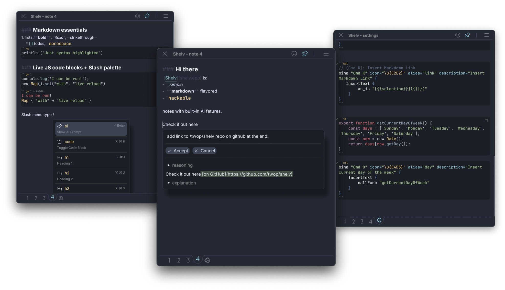

<h1 align="center">
    <b>
        <a href="https://shelv.app" style="vertical-align: middle;">Shelv</a>
    </b>
</h1>

<h3 align="center">
    {  Hackable, Local, AI-powered notes  }
</h3>

<p align="center">
    Shelv is scriptable, plain text notes app with integrated ai-features for macOS, written in Rust (btw (tm)).
</p>

<p align="center">
    <a href="https://shelv.app"><b>Website</b></a> •
    <a href="https://discord.gg/PJhJgugJ9U"><b>Discord</b></a> •
    <a href="https://apps.apple.com/us/app/shelv-notes/id6499478682"><b>Mac App Store</b></a>
</p>




<p align="center">
  <a href="https://apps.apple.com/us/app/shelv-notes/id6499478682">
    
  </a>
</p>


### Make It Yours

Settings in Shelv is just a note, where you can create custom commands with [KDL](https://kdl.dev/) and JavaScript, assign and tweak keyboard shortcuts, all with live reload.

**The origin story:** at the time I used [Bear app](https://bear.app/), which had 4 different formats of dates, but I wanted `YYYY/mmm/dd`, and I kept thinking: "if only I could _define_ what I want". Well, with Shelv you can.


---

## Features

- **Markdown Support**: Full CommonMark with extensions, including TODOs
- **Code Syntax Highlighting**: A lot of languages are supported
- **Live JavaScript Blocks**: Execute JS code directly in notes
- **Slash Menu**: Quick access to all commands and features
- **Keyboard minded**: Most actions are available via shortcuts
- **Quick Prompt**: You can ask AI about your text selection, with the note as the context (the models are also configurable!)

### Markdown stuff
1. lists,**bold**, *italic*, ~strikethrough~
	* [ ] todos, `monospace`

```rs
println!("Just syntax highlighted")
```

### Live JS code blocks

```js 1
console.log('I can be run!');
new Map().set("with", "live reload")
```

will produce this output if you press "Run" button that will appear on the left of JS code blocks.
```js 1 > #e904
I can be run!
Map { "with" → "live reload" }
```

---

## Default Shortcuts

Here is the list of keybindings that work out of the box, please tweak them to your liking. 

*Note: there can be only one keybinding for a given command, the last declared wins*

```kdl
// (⌥ ⌘ B): Toggle Code Block
bind "Option Cmd B" icon="code-block" alias="code" description="Toggle Code Block" { MarkdownCodeBlock; }

// (⌘ B): Toggle Bold
bind "Cmd B" icon="text-b" alias="bold" description="Toggle Bold" { MarkdownBold; }

// (⌘ I): Toggle Italic
bind "Cmd I" icon="text-italic" alias="italic" description="Toggle Italic" { MarkdownItalic; }

// (⇧ ⌘ E): Toggle Strikethrough
bind "Shift Cmd E" icon="text-strikethrough" alias="strike" description="Toggle Strikethrough" { MarkdownStrikethrough; }

// (⌥ ⌘ 1): Heading 1
bind "Option Cmd 1" icon="text-h-one" alias="h1" description="Heading 1" { MarkdownH1; }

// (⌥ ⌘ 2): Heading 2
bind "Option Cmd 2" icon="text-h-two" alias="h2" description="Heading 2" { MarkdownH2; }

// (⌥ ⌘ 3): Heading 3
bind "Option Cmd 3" icon="text-h-three" alias="h3" description="Heading 3" { MarkdownH3; }

// (⌃ Enter): Show AI Prompt
bind "Ctrl Enter" icon="sparkle" alias="ai" description="Show AI Prompt" { ShowPrompt; }

// (⌘ ,): Open Settings
bind "Cmd Comma" { SwitchToSettings; }

// (⌘ P): Toggle Always on Top
bind "Cmd P" { PinWindow; }

// (Escape): Hide Window
bind "Escape" { HideApp; }

// (⌘ 1): Shelf 1
bind "Cmd 1" { SwitchToNote 0; }

// (⌘ 2): Shelf 2
bind "Cmd 2" { SwitchToNote 1; }

// (⌘ 3): Shelf 3
bind "Cmd 3" { SwitchToNote 2; }

// (⌘ 4): Shelf 4
bind "Cmd 4" { SwitchToNote 3; }
```

---

## Mini Documentation

### Shelv Settings

Settings are defined in the settings note and can be accessed by clicking a gear button on the bottom bar (or `⌘ + ,`).

Settings can contain any number of markdown code blocks with `kdl` language. These blocks change the app's behavior.

#### Example: Custom Snippets via `InsertText` Command

The `InsertText` command allows you to insert either static or dynamic text into your notes:

1. **Direct text insertion:**
```kdl
bind "Cmd T" icon="text-aa" alias="test" description="Insert test text" {
    InsertText {
        string "This is a test"
    }
}
```

2. **Dynamic text via JavaScript functions:**
```kdl
bind "Cmd T" {
    InsertText {
        callFunc "myFunction"
    }
}
```

3. **JavaScript functions with selection argument:**
```kdl
bind "Cmd T" {
    InsertText {
        callFunc "myFunction" {
            selection
        }
    }
}
```

JavaScript functions must be exported from `js` code blocks in the settings note. Each block is evaluated as a separate js module from top to bottom, with exported variables automatically imported into subsequent modules. When using the `selection` child node, the currently selected text will be passed as the first argument to your JavaScript function.

#### Example: Inserting the current day of the week

```js
export function getCurrentDayOfWeek() {
    const days = ['Sunday', 'Monday', 'Tuesday', 'Wednesday', 'Thursday', 'Friday', 'Saturday'];
    const now = new Date();
    return days[now.getDay()];
}
```

```kdl
bind "Cmd D" icon="calendar" alias="day" description="Insert current day of the week" {
    InsertText {
        callFunc "getCurrentDayOfWeek"
    }
}
```

#### Example: Using selection argument in JavaScript functions

```js
export function wrapInQuotes(selectedText) {
    return `"${selectedText}"`;
}

export function makeUppercase(selectedText) {
    return selectedText.toUpperCase();
}
```

```kdl
bind "Cmd Q" icon="quotes" alias="quote" description="Wrap selection in quotes" {
    InsertText {
        callFunc "wrapInQuotes" {
            selection
        }
    }
}

bind "Cmd U" icon="text-aa" alias="upper" description="Make selection uppercase" {
    InsertText {
        callFunc "makeUppercase" {
            selection
        }
    }
}
```

#### Magic strings

These patterns can be can be used for either `callFunc` or `string`
- `{{selection}}` -> the currently selected text in a note, can be empty
- `{||}` -> cursor with no selection
- `{|}this will be selected{|}` -> cursor with selection, note that both opening and closing markers have to be present

Here is an example of a simple custom command that wraps selection with `[]`, adds `()` and sets the cursor inside
```kdl
// (Cmd K): Insert Markdown Link
bind "Cmd K" icon="link" alias="link" description="Insert Markdown Link" {
   InsertText {
        string "[{{selection}}]({||})"
    }
}
```

### Supported AI Providers

Shelv supports multiple AI providers through the [rust-genai](https://github.com/jeremychone/rust-genai) library:

- **OpenAI**: Models start with "gpt" (e.g., "gpt-4o-mini", "gpt-4")
- **Anthropic**: Models start with "claude" (e.g., "claude-3-haiku-20240307", "claude-3-5-sonnet-20240620")  
- **Cohere**: Models start with "command" (e.g., "command-light")
- **Gemini**: Models start with "gemini" (e.g., "gemini-2.0-flash")
- **Groq**: Specific model names (e.g., "llama-3.1-8b-instant")
- **Ollama**: Local model names (e.g., "gemma:2b")
- **XAI/Grok**: Specific model names (e.g., "grok-beta")
- **DeepSeek**: Specific model names (e.g., "deepseek-chat")

### Settings Schema

#### Keybinding Format
- `global`: System-wide shortcuts - Format: `global "Shortcut" { Action; }`
- `bind`: In-app keybindings - Format: `bind "Shortcut" { Action; }`

#### Optional Attributes for bind
- `icon`: Phosphor icon name for slash palette (e.g., "heart", "star", "code-simple") ([full list](https://phosphoricons.com))
- `alias`: Command name in slash palette
- `description`: Description shown in slash palette

Example: `bind "Cmd T" icon="text-aa" alias="test" description="Insert test text"`

#### AI Settings Block
- `model`: Specifies the AI model to use (optional, defaults to rate limited model)
- `systemPrompt`: Add additional instructions to the default system prompt for AI interactions (optional)
- `token`: API token for authentication (required for non-Ollama/non-Shelv models)
- `useShelvSystemPrompt`: Whether to prepend Shelv's default system prompt (default: true)

#### Available Actions

**For `bind` keyword:**
- `MarkdownBold`, `MarkdownItalic`, , `MarkdownStrikethrough`
- `MarkdownCodeBlock` or with optional language attribute `MarkdownCodeBlock lang="js"`
- `MarkdownH1`, `MarkdownH2`, `MarkdownH3`
- `PinWindow`, `RunLLMBlock`, `ShowPrompt`
- `SwitchToNote 1..4`, `SwitchToSettings`
- `InsertText`
  - Format:
    ```
    InsertText {
        string "Direct text string"
        // OR to call a js function
        callFunc "exportedJsFunctionName"
        // OR to call a js function with arguments
        callFunc "exportedJsFunctionName" {
            selection  // only selection node is currently supported
        }
    }
    ```

**For `global` keyword:**
- `ShowHideApp`

**Shortcut Format:** "Modifier1 Modifier2 Key" where modifiers are: `Cmd`, `Option`, `Shift`, `Ctrl`

---

## Frequently Asked Questions

<details>
<summary>I'm sick of AI hype, is Shelv yet another AI-'something'?</summary>

I hope not, my opinions toward AI (or rather LLMs) are mixed. My current position can be roughly outlined as:
- AI is not a "higher-level abstraction" like programming languages over assembly. For a simple reason: it is not deterministic.
- Using AI may and likely will cause skill degradation if used as a solo replacement for typing code or writing prose (like "vibe coding").
- I think the best use of it (at the moment) is if you can expertly assess the output. So the UX I'm leaning towards will try to emphasize that idea.
- Luckily, working with text, adding small scripts, etc. qualifies as such.
- But moreover, I think it can be used as a discovery tool - try asking with a quick prompt, "What are the current keybindings?"

I hope I've convinced you to give Shelv a try.

</details>

<details>
<summary>Is Shelv coming to Mobile/Window/Web?</summary>

Yes, but with time (and perhaps your help). Shelv is written in Rust + [egui](https://egui.rs/), which has some cross-platform support.

</details>

<details>
<summary>How do you make money?</summary>

I don't. I worked on Shelv for over 2 years, and I had a dream to start company (still do), but as of now, it's a labor of love. In the future, there may be a way to purchase AI tokens. Currently, Shelv uses my personal token with a cap, but you can always configure your own provider (including [Ollama](https://ollama.com/).

</details>

<details>
<summary>Does Shelv have sync functionality?</summary>

Not yet, I'm a local first movement fan, and wanted to use [Automerge](https://github.com/automerge/automerge) since forever, ideally with e2e encryption with a pure Rust server. This is something that's being worked on right now, but e2e encrypted scalable sync ain't easy both technically and from a product perspective.

</details>

<details>
<summary>Is Shelv open source?</summary>

Yes and no, Shelv is licensed under the [Komorebi License](https://github.com/LGUG2Z/komorebi-license) 2.0.0, so more like "source available".

This limits you from compiling Shelv for work or repackaging it to a new app, but you can fork it for non-commercial personal use or with the intention of contributing changes back.
However you can (and hopefully always) just use the version from the app store, which grants **personal** commercial use (such as using it at work for productivity). 

Read more [below](#License)

</details>

<details>
<summary>Is it Native?</summary>

Native is a spectrum, Shelv is written in Rust using [egui](https://egui.rs/) as the gui toolkit, not Swift UI tech stack. Maybe the closest analogy would be [Flutter](https://flutter.dev/) that is painting every pixel. Are Flutter apps native? I think so.

</details>

<details>
<summary>Are my beloved vim motions supported?</summary>

I am a [Helix](https://helix-editor.com/) user myself, but markdown and text are a bit different from code. That said, I would love to support modal editing in the future. Perhaps some features can be added for "insert" mode (which is the only mode at the moment) that can enhance editing, for example: jump to a word, press any buttons with a label(vimium style), expand + shrink semantic selection etc. I need to work on Shelv full-time to justify adding vim or helix motions to egui TextEdit, vote with your money I guess, oh wait, I don't have a way to actually recieve money...

</details>

<details>
<summary>Are you collecting any analytics?</summary>

Not at the moment (besides crash reporting), but I'm not fundamentally opposed to collecting statistics, because it is hard to know if a feature is even used without some observability. I do think it can be done with privacy in mind (at least anonymizing and being mindful of where the data is stored). Probably in the future, however, when and if I add monetization, I'll likely start collecting emails associated with a purchase and/or install.

</details>

---

## Roadmap

**Done:**
- Initial launch on macOS: Sep 2025
  - Barebones editing with 4 notes
  - Optimized for quick capture
  - No Shelv API exposed to JS scripts

**Coming:**
- Multi-file + workspace support
  - Workspace folder with notes inside
  - Import from [Obsidian](https://obsidian.md/)
  - File tree + workspace viewer
- Agentic mode
  - Tools/MCP that allow to search/move/create/edit notes
  - UI for having agentic workflows, probably just a chat that is going to be just another file
  - Files that define custom workflows, similar to Claude Code
- Core editing features:
  - Semantic selection: expand and shrink cursor selection with markdown AST nodes
  - Jump to an *element*, jump to any word on the screen with a couple of keystrokes (similar to Vimium and Helix)
  - Search, Redo etc
- Support for pasting/rendering images
- Rich API exposed to JS + better scripting capabilities (like sharing code among notes)
- Sync 
  - I plan to use [Automerge](https://github.com/automerge/automerge) for personal syncing, which can be also used for collaboration
  - Dump to git, e.g. backup all the notes to git, potentially with AI-generated change summary
- Web version
  - Mobile (including web) version is TBD
- Collaboration
  - Share a note via link (co-editing on the web)
  - Share workspace, that is, co-ownership of a collection of folder+notes

---

## Building and Running

### Prerequisites
- Rust (latest stable version)
- macOS (for now only on macOS, I wish I would have enough money and time to make Windows, Linux, Web and mobile versions! But alas)

### Build Commands

```bash
# Run the application
cargo run

# Run tests
cargo test
```

Yep, that is it.

### Shelv is built with:
- **[Rust](https://github.com/rust-lang/rust)** for core application logic
- **[egui](https://github.com/emilk/egui) + [eframe](https://github.com/emilk/egui/tree/master/crates/eframe)** for cross-platform GUI
- **[Boa engine](https://github.com/boa-dev/boa)** for JavaScript runtime in code blocks
- **[pulldown-cmark](https://github.com/raphlinus/pulldown-cmark)** for Markdown parsing
- **[syntect](https://github.com/trishume/syntect)** for syntax highlighting
- **[global-hotkey](https://github.com/tauri-apps/global-hotkey)** for system-wide shortcuts
- **[tray-icon](https://github.com/tauri-apps/tray-icon)** for system tray functionality
- **[genai](https://github.com/jeremychone/rust-genai)** for LLM integration
- **[KDL](https://github.com/kdl-org/kdl)** for configuration language

---

## Links

- **[Homepage](https://shelv.app)** - sources under `/site` folder
- **[Discord](https://discord.gg/PJhJgugJ9U)** - ask for help, give feedback, or just say "hi"!

[](https://apps.apple.com/us/app/shelv-notes/id6499478682)

---

## License

### Summary

- You can fork Shelv for the intended purpose of contributing features upstream or for non-commercial use only
- You can use the Mac App Store version for personal use at work or home freely
- In the future, there might be a team license available for purchase separately

*The overall structure is inspired by the [komorebi project](https://github.com/LGUG2Z/komorebi). Thank you [LGUG2Z](https://github.com/LGUG2Z) for being an inspiration!*

### Komorebi License

Shelv is licensed under the [Komorebi License](https://github.com/LGUG2Z/komorebi-license) 2.0.0. 

This license does not permit any kind of commercial use. If you are a business owner, the act of forking this repository, making changes to it and then using your fork in your business constitutes commercial use.

If you would like to discuss commercial licensing, feel free to reach out.

### Personal Commercial Use

Personal commercial use (such as using Shelv for personal productivity while at work) is automatically granted with the Mac App Store version of Shelv.

