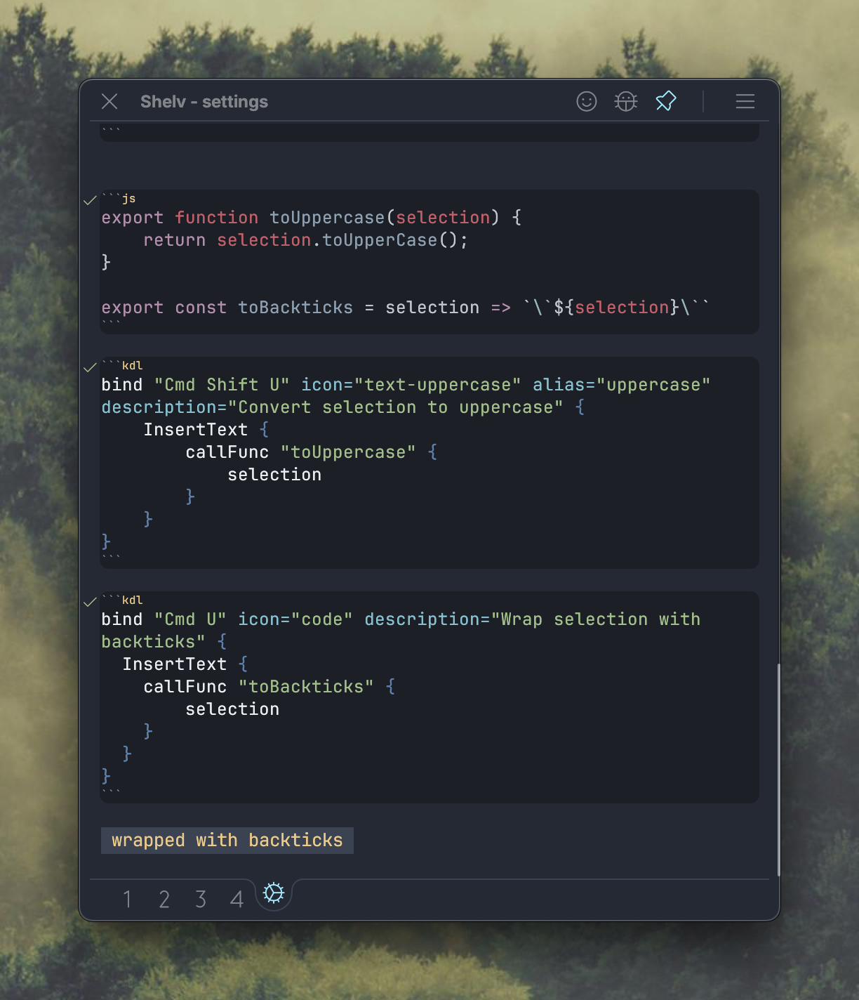

## What's New

### Selection Argument Support

JavaScript functions in `InsertText` commands can now receive selected text as an argument, enabling more interesting text transformation workflows:

- Use `selection` child node in KDL configuration to pass selected text to JS functions
- Enables custom text transformation commands (e.g., wrap in quotes, make uppercase, format code)


### Example Usage

#### Convert selection to upper case
```js
// js block
export function toUppercase(selection) {
    return selection.toUpperCase();
}
```

```kdl
// kdl block
bind "Cmd Shift U" icon="text-uppercase" alias="uppercase" description="Convert selection to uppercase" {
    InsertText {
        callFunc "toUppercase" {
            selection
        }
    }
}
```


#### Wrap with backticks
```js
// js block
export const toBackticks = selection => `\`${selection}\``
```

```kdl
// kdl block
bind "Cmd U" icon="code" description="Wrap selection with backticks" {
  InsertText {
    callFunc "toBackticks" {
        selection
    }
  }
}
```

How it might look in settings:



For completeness: backticks can be expressed without a JS block too, like so:
```kdl
// kdl block
bind "Cmd U" icon="code" description="Wrap selection with backticks" {
  InsertText {
        string "`{{selection}}`"
    }
}
```

Have fun optimizing your workflow!


---

*Thank you for using Shelv!*
