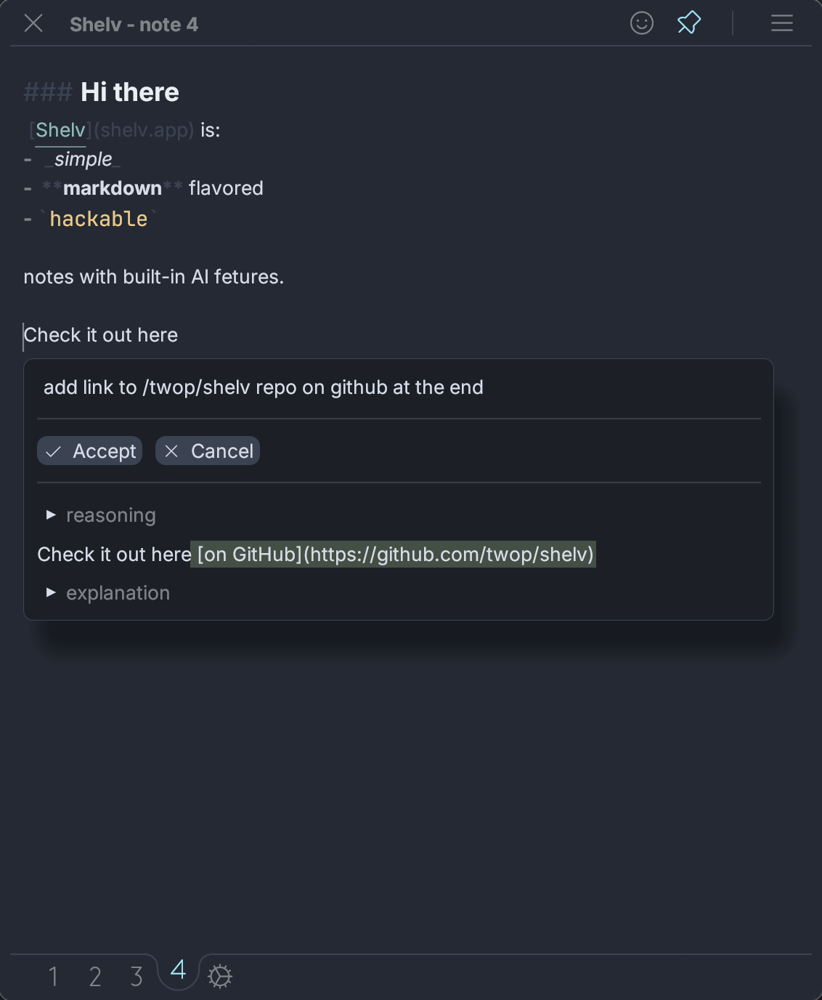

# Version 1.4.0 - New Features

This release brings powerful new features to enhance your Shelv experience with Word Jump Navigation, a comprehensive Notification System, and significant Command System improvements.

## What's New

### Word Jump Navigation
Navigate through your notes at lightning speed with our new quick navigation feature inspired by Vim/Helix editors:

- Press `⌘ J` to activate Word Jump mode
- Visual letter combinations appear next to words throughout the note
- Type 2-character sequences to instantly jump to any word
- Accessible via keyboard shortcut (`⌘ J` by default) and slash palette (`/jump`)

### Notification System
A flexible notification framework with custom content rendering ([#189](https://github.com/twop/shelv/pull/189)):

- Programmatic creation with title, icon, color, message support and action button
- Trait-based custom content rendering system
- Animation effects for appearance and disappearance
- Developer tools for testing notifications

### Update Notifications
Stay informed about new features with automatic update notifications ([#190](https://github.com/twop/shelv/issues/190)):

- Version-specific update messages with custom content
- Uses the notification system described above
- App version is stored in `state.json`

## What's Changed

### Command System Rework
Major overhaul of the application's command system ([#187](https://github.com/twop/shelv/pull/187)):

- After egui update to 32, the previous hotkey system needed rebuilding
- Added conditions to commands using bool algebra and attribute checking
- Introduced raw input hook phase to handle keybinding conflicts
- Made frame hotkeys more ergonomic and unified with Commands system
- Built debugger UI for inspecting current state and action logs

### Documentation Updates
- Updated system prompt to include Word Jump command documentation
- Added tutorial for Word Jump Navigation
- Improved README with dedicated Word Jump section and usage examples

## Getting Started

To try out Word Jump Navigation:

1. Open any note
2. Press `⌘ J` (or use `/jump` from the slash palette)
3. See letter combinations appear next to words
4. Type any 2-character sequence to jump instantly

---

*Thank you for using Shelv!*
